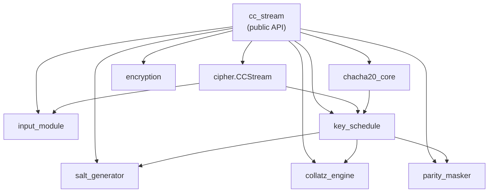

# API Reference

Full auto-generated reference for every public symbol in CC-Stream.
All docstrings follow **Google style** (Args / Returns / Raises sections).

---

## Module Map

---

## Quick Symbol Index

| Symbol | Module | Purpose |
|--------|--------|---------|
| `CCStream` | `cipher` | Main API — encrypt, decrypt, stream |
| `validate` | `input_module` | Check key / nonce / counter |
| `key_to_words` | `input_module` | 32 bytes → 8 LE 32-bit words |
| `nonce_to_words` | `input_module` | 12 bytes → 3 LE 32-bit words |
| `generate` | `salt_generator` | Derive 64-byte salt |
| `iterate` | `collatz_engine` | Run T Collatz steps → parity sequence |
| `generate_matrix` | `parity_masker` | Build m×T binary matrix R |
| `mask` | `parity_masker` | Compute π = R·b (mod 2) |
| `trajectory_to_words` | `key_schedule` | Parity + x_T + π → 32-bit words |
| `augment_key` | `key_schedule` | ck_i = k_i ⊕ rk_i |
| `build` | `key_schedule` | Full key schedule pipeline |
| `block` | `chacha20_core` | One 64-byte ChaCha20 block |
| `initialize_state` | `chacha20_core` | Build 4×4 initial state |
| `keystream` | `chacha20_core` | Generate N bytes of keystream |
| `xor_bytes` | `encryption` | XOR data with keystream |

---

## Package-Level Exports

::: cc_stream
    options:
      show_source: false
      show_root_heading: true
      members:
        - CCStream
        - T_DEFAULT
        - M_DEFAULT
