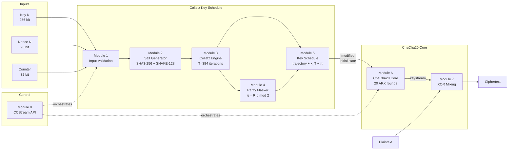

# Architecture

CC-Stream is built from **eight independent modules** arranged in two
conceptual layers: the Collatz key schedule (modules 1–5) and the
ChaCha20 encryption core (modules 6–8).

---

## Block Diagram



---

## Data Flow — Step by Step

### Stage 1: Input & Salt Derivation (Modules 1–2)

The 256-bit key, 96-bit nonce, and 32-bit block counter are validated
and fed into **SHA3-256** together to produce a deterministic 32-byte
base hash, extended to 64 bytes via **SHAKE-128**:

```
salt = SHAKE-128( SHA3-256(K ‖ N ‖ ctr) )  [64 bytes]
```

Each byte of `salt` controls the multiplier selection (`3` or `5`)
at the corresponding Collatz step.

---

### Stage 2: Collatz Iteration Engine (Module 3)

A 32-byte seed derived from `SHA3-256(K ‖ N ‖ ctr)` is converted to
a large integer (forced odd) and iterated exactly **T = 384** times:

| Parity of `x` | Step rule |
|---------------|-----------|
| Even (bit = 0) | `x = x >> 1` |
| Odd  (bit = 1) | `a = salt_bit ? 5 : 3` then `x = (a·x + 1) >> 1` |

The same **T** iterations always run — no early exit — eliminating
timing side-channels.  Values are kept within 512 bits via modular
reduction.

This produces:

- **`parity_seq`** — 384 bits recording whether each step was odd or even
- **`x_T`** — the final 512-bit integer

---

### Stage 3: Parity Masking / PSC-QOWF Layer (Module 4)

An `m × T` binary matrix `R` is derived deterministically from the seed:

```
τ = SHAKE-256( SHA3-256("parity_matrix_v1" ‖ seed) )
```

The masked sketch is computed as:

$$\pi = R \cdot b \pmod{2}$$

where `b` is the raw parity sequence.  Inverting `π` to recover `b`
requires solving an unstructured search of size \(2^{T-m} = 2^{256}\)
classically and \(2^{128}\) with Grover's algorithm.

!!! info "Why masking matters"
    Without masking, an attacker watching the parity bits directly would
    have structural information about the Collatz trajectory.  The `m × T`
    matrix multiplication compresses 384 bits into 128 constrained bits,
    hiding the trajectory while preserving its entropy contribution.

---

### Stage 4: Key Schedule (Module 5)

The key schedule produces a 512-bit modified ChaCha20 initial state from
three independent sources:

```
constants[0:4]  = traj_bytes[0:16]   ⊕  SHA3-256("collatz_final_v1" ‖ x_T)[0:16]
round_keys[0:8] = traj_bytes[16:48]  ⊕  SHA3-256("parity_mask_v1"   ‖ π  )[0:32]
ck_i            = k_i ⊕ round_keys[i]
```

The final initial state matrix is:

```
┌──────────────────────────────────────────┐
│  cc0    cc1    cc2    cc3                 │  ← Collatz constants (row 0)
│  ck0    ck1    ck2    ck3                 │  ← Augmented key     (row 1)
│  ck4    ck5    ck6    ck7                 │  ← Augmented key     (row 2)
│  ctr    n0     n1     n2                  │  ← Counter + nonce   (row 3)
└──────────────────────────────────────────┘
```

---

### Stage 5: ChaCha20 Core (Module 6)

The 4×4 matrix above replaces ChaCha20's fixed `"expand 32-byte k"`
constants with Collatz-derived values.  The **round function is
unchanged from RFC 8439** — 10 column rounds + 10 diagonal rounds,
each applying:

```
QR(a, b, c, d):
    a += b;  d ^= a;  d <<<= 16
    c += d;  b ^= c;  b <<<= 12
    a += b;  d ^= a;  d <<<= 8
    c += d;  b ^= c;  b <<<= 7
```

This preserves every known security property of ChaCha20.

---

### Stage 6: XOR Encryption (Module 7)

```
C[i] = P[i] ⊕ Keystream[i]
```

The same operation decrypts.  The block counter increments for each
64-byte block, preventing keystream reuse across blocks.

---

## Module Responsibility Summary

| Module | Name | Role |
|--------|------|------|
| 1 | `input_module` | Validate key / nonce / counter formats |
| 2 | `salt_generator` | Derive 64-byte salt from `(K, N, ctr)` via SHA3 + SHAKE |
| 3 | `collatz_engine` | Run T bounded, salted Collatz iterations; record parity |
| 4 | `parity_masker` | Compute π = R·b (mod 2); hide raw trajectory |
| 5 | `key_schedule` | Map `(parity_seq, x_T, π)` → modified ChaCha20 state |
| 6 | `chacha20_core` | Standard 20-round ARX keystream generator |
| 7 | `encryption` | XOR keystream with plaintext / ciphertext |
| 8 | `cipher` | Orchestration, stateful counter, public API |
