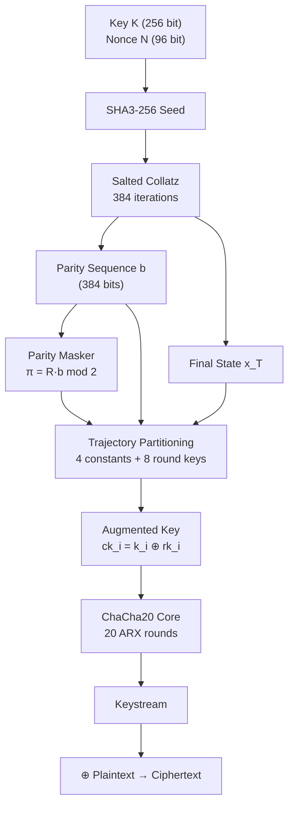

# CC-Stream

**CC-Stream** is a defense-in-depth stream cipher that layers a
**Collatz-based key schedule** on top of the proven **ChaCha20 core**.

<div class="grid cards" markdown>

-   :material-lock-outline:{ .lg .middle } **Post-Quantum Hardening**

    ---

    The Collatz key schedule adds an independent, algebraically unrelated
    hardness layer — inverting it requires solving
    \(2^{256}\) classical / \(2^{128}\) quantum search problems.

-   :material-swap-horizontal:{ .lg .middle } **Drop-In ChaCha20 Replacement**

    ---

    Same 256-bit key, 96-bit nonce, 32-bit counter interface as RFC 8439.
    Plug directly into TLS, SSH, or VPN stacks.

-   :material-layers-outline:{ .lg .middle } **Defense in Depth**

    ---

    Two independent hardness assumptions: break **both** the Collatz layer
    and the ARX core to win. Compromising one is not enough.

-   :material-code-braces:{ .lg .middle } **Modular Architecture**

    ---

    Eight independently testable modules. Each can be audited, swapped,
    or strengthened without touching the rest of the cipher.

</div>

---

## Quick Start

```python
from cc_stream import CCStream

# Generate a fresh key and nonce
key   = CCStream.generate_key()    # 32 random bytes
nonce = CCStream.generate_nonce()  # 12 random bytes

# Encrypt
cipher = CCStream(key, nonce)
ciphertext = cipher.encrypt(b"Hello, CC-Stream!")

# Decrypt (same key + nonce, fresh instance)
decipher = CCStream(key, nonce)
plaintext = decipher.decrypt(ciphertext)

assert plaintext == b"Hello, CC-Stream!"
```

---

## How It Works



---

## Project Layout

```
cc-stream/
├── src/cc_stream/
│   ├── __init__.py          Public API
│   ├── cipher.py            Module 8 — CCStream (main API)
│   ├── input_module.py      Module 1 — Key / nonce validation
│   ├── salt_generator.py    Module 2 — SHA3 + SHAKE salt derivation
│   ├── collatz_engine.py    Module 3 — Bounded Collatz iteration
│   ├── parity_masker.py     Module 4 — PSC-QOWF masking (π = R·b)
│   ├── key_schedule.py      Module 5 — Collatz → ChaCha20 state
│   ├── chacha20_core.py     Module 6 — Standard ChaCha20 (RFC 8439)
│   ├── encryption.py        Module 7 — XOR keystream mixing
│   └── cli.py               CLI (keygen, encrypt, decrypt, …)
└── tests/                   93 pytest tests
```

---

## References

| # | Reference |
|---|-----------|
| 1 | D. J. Bernstein, *ChaCha, a variant of Salsa20*, SASC 2008 |
| 2 | Langley et al., *RFC 8439: ChaCha20 and Poly1305 for IETF Protocols*, 2018 |
| 3 | J. C. Lagarias (ed.), *The Ultimate Challenge: The 3x+1 Problem*, AMS, 2010 |
| 4 | T. Tao, *Almost all orbits of the Collatz map attain almost bounded values*, Forum of Mathematics Pi, 2022 |
| 5 | A. Kelekhsaevi, *PSC-QOWF: Path-Search Collatz Quantum-Resistant One-Way Functions*, 2025 |
